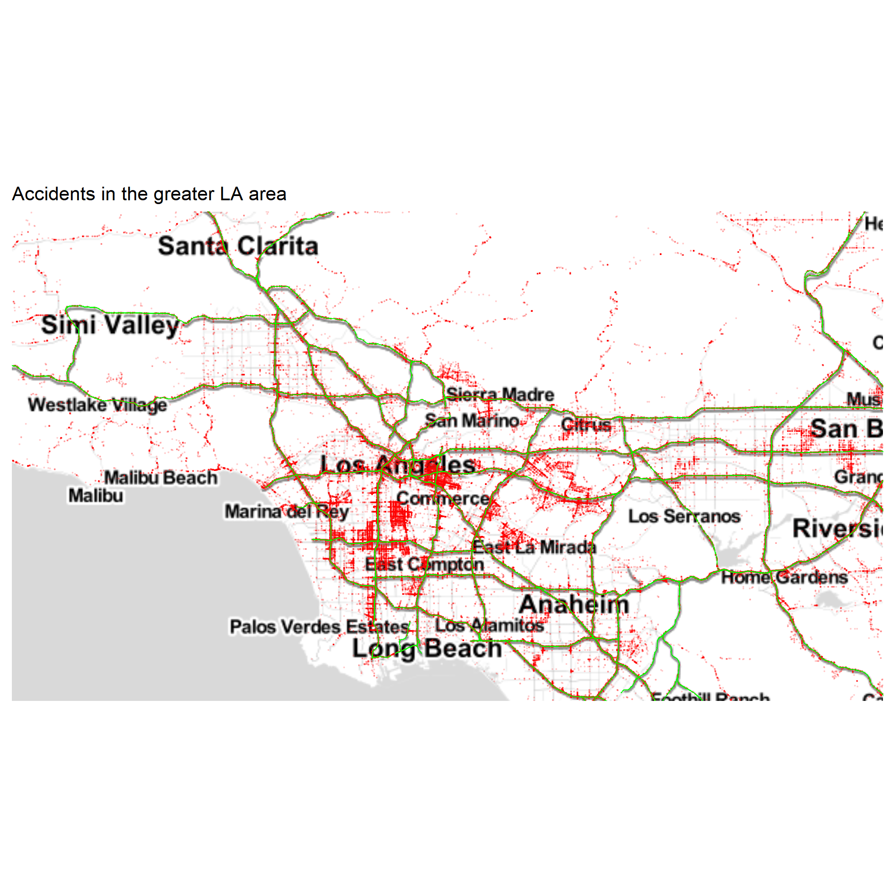
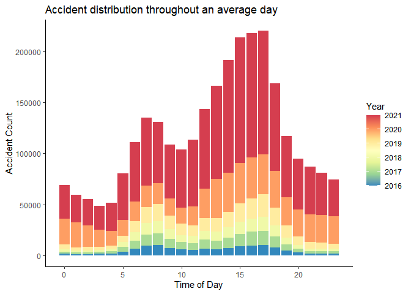
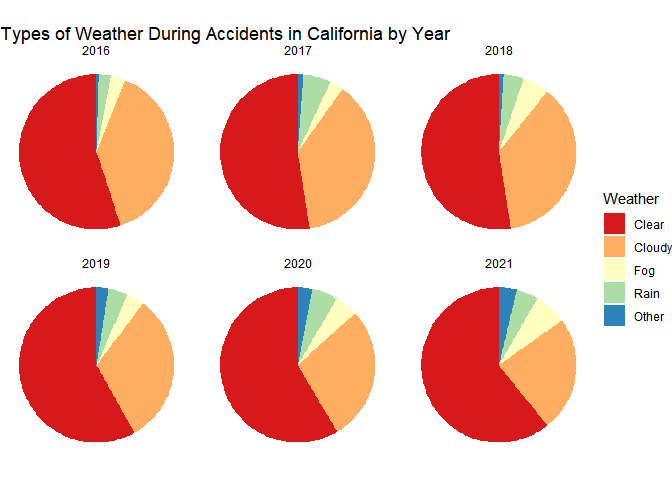

# Introduction
  In our search for an interesting dataset to analyze we came across a wonderfully organized table detailing traffic accidents in the contiguous United States over the last 5 years. What caught our interest in specific was looking at the evolution over time of crash statistics in specific states- most notably California. As the graph below shows, the number of accidents in California has been doubling each year, and we wanted to figure out just what was happening. The dataset we're working with is extraordinarily large, containing over 2.8 million accidents taken from automated traffic sensors and logged reports. Each accident has 47 columns of information.
  
  Car accidents are interesting in their ubiquity. Roads cover the majority of the United States, and in most cases one wouldn't expect too much regional variation- sure snowy states might have higher rates of accidents during winter, but the physical conditions that might cause more accidents are often widespread or have analogues in other climates. This leaves us to consider the sociological factor which may be behind differences in driving safety in addition to more tangible dangers on the road.


# Data Collection
  Our Data Collection process was pretty simple- we found the data set on [https://www.kaggle.com/datasets/sobhanmoosavi/us-accidents]() and downloaded the csv file. We did run into some issues using this csv, due to its sheer size (1.1 GB). The fun thing about this data set is that it contains so many details about each crash, which allows us to look for correlations without them being spoon-fed to us. Additionally, the types of data provided allowed us to explore quite a few different types of visualizations: the time was given for each crash, as well as location plus details on the cause of the crash.
    While the Data Collection was relatively straightforward, the manipulations took a little more work. 

# Analysis

  After deciding to focus in on California, we wanted to take a closer look at the distribution of accidents within the state. Unsurprisingly, this showed that the vast majority of accidents were clustered in Los Angeles, and to a lesser extent the south of the state in general. The second map plots all of the accidents recorded in the data set over a map of Los Angeles.This shows the clustering of accidents in the busier parts of the city and freeways.
  
## Spacial trends


<!-- -->
```{=html}
<div id="upfsomwkul" style="overflow-x:auto;overflow-y:auto;width:auto;height:auto;">
<style>html {
  font-family: -apple-system, BlinkMacSystemFont, 'Segoe UI', Roboto, Oxygen, Ubuntu, Cantarell, 'Helvetica Neue', 'Fira Sans', 'Droid Sans', Arial, sans-serif;
}

#upfsomwkul .gt_table {
  display: table;
  border-collapse: collapse;
  margin-left: auto;
  margin-right: auto;
  color: #333333;
  font-size: 16px;
  font-weight: normal;
  font-style: normal;
  background-color: #FFFFFF;
  width: auto;
  border-top-style: solid;
  border-top-width: 2px;
  border-top-color: #A8A8A8;
  border-right-style: none;
  border-right-width: 2px;
  border-right-color: #D3D3D3;
  border-bottom-style: solid;
  border-bottom-width: 2px;
  border-bottom-color: #A8A8A8;
  border-left-style: none;
  border-left-width: 2px;
  border-left-color: #D3D3D3;
}

#upfsomwkul .gt_heading {
  background-color: #C63F41;
  text-align: center;
  border-bottom-color: #FFFFFF;
  border-left-style: none;
  border-left-width: 1px;
  border-left-color: #D3D3D3;
  border-right-style: none;
  border-right-width: 1px;
  border-right-color: #D3D3D3;
}

#upfsomwkul .gt_title {
  color: #FFFFFF;
  font-size: 125%;
  font-weight: initial;
  padding-top: 4px;
  padding-bottom: 4px;
  padding-left: 5px;
  padding-right: 5px;
  border-bottom-color: #FFFFFF;
  border-bottom-width: 0;
}

#upfsomwkul .gt_subtitle {
  color: #FFFFFF;
  font-size: 85%;
  font-weight: initial;
  padding-top: 0;
  padding-bottom: 6px;
  padding-left: 5px;
  padding-right: 5px;
  border-top-color: #FFFFFF;
  border-top-width: 0;
}

#upfsomwkul .gt_bottom_border {
  border-bottom-style: solid;
  border-bottom-width: 2px;
  border-bottom-color: #D3D3D3;
}

#upfsomwkul .gt_col_headings {
  border-top-style: solid;
  border-top-width: 2px;
  border-top-color: #D3D3D3;
  border-bottom-style: solid;
  border-bottom-width: 2px;
  border-bottom-color: #D3D3D3;
  border-left-style: none;
  border-left-width: 1px;
  border-left-color: #D3D3D3;
  border-right-style: none;
  border-right-width: 1px;
  border-right-color: #D3D3D3;
}

#upfsomwkul .gt_col_heading {
  color: #333333;
  background-color: #FFFFFF;
  font-size: 100%;
  font-weight: normal;
  text-transform: inherit;
  border-left-style: none;
  border-left-width: 1px;
  border-left-color: #D3D3D3;
  border-right-style: none;
  border-right-width: 1px;
  border-right-color: #D3D3D3;
  vertical-align: bottom;
  padding-top: 5px;
  padding-bottom: 6px;
  padding-left: 5px;
  padding-right: 5px;
  overflow-x: hidden;
}

#upfsomwkul .gt_column_spanner_outer {
  color: #333333;
  background-color: #FFFFFF;
  font-size: 100%;
  font-weight: normal;
  text-transform: inherit;
  padding-top: 0;
  padding-bottom: 0;
  padding-left: 4px;
  padding-right: 4px;
}

#upfsomwkul .gt_column_spanner_outer:first-child {
  padding-left: 0;
}

#upfsomwkul .gt_column_spanner_outer:last-child {
  padding-right: 0;
}

#upfsomwkul .gt_column_spanner {
  border-bottom-style: solid;
  border-bottom-width: 2px;
  border-bottom-color: #D3D3D3;
  vertical-align: bottom;
  padding-top: 5px;
  padding-bottom: 5px;
  overflow-x: hidden;
  display: inline-block;
  width: 100%;
}

#upfsomwkul .gt_group_heading {
  padding-top: 8px;
  padding-bottom: 8px;
  padding-left: 5px;
  padding-right: 5px;
  color: #333333;
  background-color: #FFFFFF;
  font-size: 100%;
  font-weight: initial;
  text-transform: inherit;
  border-top-style: solid;
  border-top-width: 2px;
  border-top-color: #D3D3D3;
  border-bottom-style: solid;
  border-bottom-width: 2px;
  border-bottom-color: #D3D3D3;
  border-left-style: none;
  border-left-width: 1px;
  border-left-color: #D3D3D3;
  border-right-style: none;
  border-right-width: 1px;
  border-right-color: #D3D3D3;
  vertical-align: middle;
}

#upfsomwkul .gt_empty_group_heading {
  padding: 0.5px;
  color: #333333;
  background-color: #FFFFFF;
  font-size: 100%;
  font-weight: initial;
  border-top-style: solid;
  border-top-width: 2px;
  border-top-color: #D3D3D3;
  border-bottom-style: solid;
  border-bottom-width: 2px;
  border-bottom-color: #D3D3D3;
  vertical-align: middle;
}

#upfsomwkul .gt_from_md > :first-child {
  margin-top: 0;
}

#upfsomwkul .gt_from_md > :last-child {
  margin-bottom: 0;
}

#upfsomwkul .gt_row {
  padding-top: 8px;
  padding-bottom: 8px;
  padding-left: 5px;
  padding-right: 5px;
  margin: 10px;
  border-top-style: solid;
  border-top-width: 1px;
  border-top-color: #D3D3D3;
  border-left-style: none;
  border-left-width: 1px;
  border-left-color: #D3D3D3;
  border-right-style: none;
  border-right-width: 1px;
  border-right-color: #D3D3D3;
  vertical-align: middle;
  overflow-x: hidden;
}

#upfsomwkul .gt_stub {
  color: #333333;
  background-color: #FFFFFF;
  font-size: 100%;
  font-weight: initial;
  text-transform: inherit;
  border-right-style: solid;
  border-right-width: 2px;
  border-right-color: #D3D3D3;
  padding-left: 5px;
  padding-right: 5px;
}

#upfsomwkul .gt_stub_row_group {
  color: #333333;
  background-color: #FFFFFF;
  font-size: 100%;
  font-weight: initial;
  text-transform: inherit;
  border-right-style: solid;
  border-right-width: 2px;
  border-right-color: #D3D3D3;
  padding-left: 5px;
  padding-right: 5px;
  vertical-align: top;
}

#upfsomwkul .gt_row_group_first td {
  border-top-width: 2px;
}

#upfsomwkul .gt_summary_row {
  color: #333333;
  background-color: #FFFFFF;
  text-transform: inherit;
  padding-top: 8px;
  padding-bottom: 8px;
  padding-left: 5px;
  padding-right: 5px;
}

#upfsomwkul .gt_first_summary_row {
  border-top-style: solid;
  border-top-color: #D3D3D3;
}

#upfsomwkul .gt_first_summary_row.thick {
  border-top-width: 2px;
}

#upfsomwkul .gt_last_summary_row {
  padding-top: 8px;
  padding-bottom: 8px;
  padding-left: 5px;
  padding-right: 5px;
  border-bottom-style: solid;
  border-bottom-width: 2px;
  border-bottom-color: #D3D3D3;
}

#upfsomwkul .gt_grand_summary_row {
  color: #333333;
  background-color: #FFFFFF;
  text-transform: inherit;
  padding-top: 8px;
  padding-bottom: 8px;
  padding-left: 5px;
  padding-right: 5px;
}

#upfsomwkul .gt_first_grand_summary_row {
  padding-top: 8px;
  padding-bottom: 8px;
  padding-left: 5px;
  padding-right: 5px;
  border-top-style: double;
  border-top-width: 6px;
  border-top-color: #D3D3D3;
}

#upfsomwkul .gt_striped {
  background-color: #ADD8E6;
}

#upfsomwkul .gt_table_body {
  border-top-style: solid;
  border-top-width: 2px;
  border-top-color: #D3D3D3;
  border-bottom-style: solid;
  border-bottom-width: 2px;
  border-bottom-color: #D3D3D3;
}

#upfsomwkul .gt_footnotes {
  color: #333333;
  background-color: #FFFFFF;
  border-bottom-style: none;
  border-bottom-width: 2px;
  border-bottom-color: #D3D3D3;
  border-left-style: none;
  border-left-width: 2px;
  border-left-color: #D3D3D3;
  border-right-style: none;
  border-right-width: 2px;
  border-right-color: #D3D3D3;
}

#upfsomwkul .gt_footnote {
  margin: 0px;
  font-size: 90%;
  padding-left: 4px;
  padding-right: 4px;
  padding-left: 5px;
  padding-right: 5px;
}

#upfsomwkul .gt_sourcenotes {
  color: #333333;
  background-color: #FFFFFF;
  border-bottom-style: none;
  border-bottom-width: 2px;
  border-bottom-color: #D3D3D3;
  border-left-style: none;
  border-left-width: 2px;
  border-left-color: #D3D3D3;
  border-right-style: none;
  border-right-width: 2px;
  border-right-color: #D3D3D3;
}

#upfsomwkul .gt_sourcenote {
  font-size: 90%;
  padding-top: 4px;
  padding-bottom: 4px;
  padding-left: 5px;
  padding-right: 5px;
}

#upfsomwkul .gt_left {
  text-align: left;
}

#upfsomwkul .gt_center {
  text-align: center;
}

#upfsomwkul .gt_right {
  text-align: right;
  font-variant-numeric: tabular-nums;
}

#upfsomwkul .gt_font_normal {
  font-weight: normal;
}

#upfsomwkul .gt_font_bold {
  font-weight: bold;
}

#upfsomwkul .gt_font_italic {
  font-style: italic;
}

#upfsomwkul .gt_super {
  font-size: 65%;
}

#upfsomwkul .gt_footnote_marks {
  font-style: italic;
  font-weight: normal;
  font-size: 75%;
  vertical-align: 0.4em;
}

#upfsomwkul .gt_asterisk {
  font-size: 100%;
  vertical-align: 0;
}

#upfsomwkul .gt_slash_mark {
  font-size: 0.7em;
  line-height: 0.7em;
  vertical-align: 0.15em;
}

#upfsomwkul .gt_fraction_numerator {
  font-size: 0.6em;
  line-height: 0.6em;
  vertical-align: 0.45em;
}

#upfsomwkul .gt_fraction_denominator {
  font-size: 0.6em;
  line-height: 0.6em;
  vertical-align: -0.05em;
}
</style>
<table class="gt_table">
  <thead class="gt_header">
    <tr>
      <th colspan="8" class="gt_heading gt_title gt_font_normal gt_bottom_border" style>Top 10 Accident-Prone Counties</th>
    </tr>
    
  </thead>
  <thead class="gt_col_headings">
    <tr>
      <th class="gt_col_heading gt_columns_bottom_border gt_left" rowspan="1" colspan="1">County</th>
      <th class="gt_col_heading gt_columns_bottom_border gt_right" rowspan="1" colspan="1">Accidents</th>
      <th class="gt_col_heading gt_columns_bottom_border gt_right" rowspan="1" colspan="1">2016</th>
      <th class="gt_col_heading gt_columns_bottom_border gt_right" rowspan="1" colspan="1">2017</th>
      <th class="gt_col_heading gt_columns_bottom_border gt_right" rowspan="1" colspan="1">2018</th>
      <th class="gt_col_heading gt_columns_bottom_border gt_right" rowspan="1" colspan="1">2019</th>
      <th class="gt_col_heading gt_columns_bottom_border gt_right" rowspan="1" colspan="1">2020</th>
      <th class="gt_col_heading gt_columns_bottom_border gt_right" rowspan="1" colspan="1">2021</th>
    </tr>
  </thead>
  <tbody class="gt_table_body">
    <tr><td class="gt_row gt_left">Los Angeles</td>
<td class="gt_row gt_right">234122</td>
<td class="gt_row gt_right">11432</td>
<td class="gt_row gt_right">12740</td>
<td class="gt_row gt_right">14088</td>
<td class="gt_row gt_right">33169</td>
<td class="gt_row gt_right">55562</td>
<td class="gt_row gt_right">107131</td></tr>
    <tr><td class="gt_row gt_left gt_striped">San Bernardino</td>
<td class="gt_row gt_right gt_striped">55018</td>
<td class="gt_row gt_right gt_striped">1603</td>
<td class="gt_row gt_right gt_striped">2037</td>
<td class="gt_row gt_right gt_striped">1656</td>
<td class="gt_row gt_right gt_striped">7022</td>
<td class="gt_row gt_right gt_striped">14563</td>
<td class="gt_row gt_right gt_striped">28137</td></tr>
    <tr><td class="gt_row gt_left">Orange</td>
<td class="gt_row gt_right">51331</td>
<td class="gt_row gt_right">2592</td>
<td class="gt_row gt_right">2763</td>
<td class="gt_row gt_right">2302</td>
<td class="gt_row gt_right">7410</td>
<td class="gt_row gt_right">12011</td>
<td class="gt_row gt_right">24253</td></tr>
    <tr><td class="gt_row gt_left gt_striped">San Diego</td>
<td class="gt_row gt_right gt_striped">48366</td>
<td class="gt_row gt_right gt_striped">2716</td>
<td class="gt_row gt_right gt_striped">2641</td>
<td class="gt_row gt_right gt_striped">2073</td>
<td class="gt_row gt_right gt_striped">6289</td>
<td class="gt_row gt_right gt_striped">10470</td>
<td class="gt_row gt_right gt_striped">24177</td></tr>
    <tr><td class="gt_row gt_left">Sacramento</td>
<td class="gt_row gt_right">46708</td>
<td class="gt_row gt_right">1669</td>
<td class="gt_row gt_right">1524</td>
<td class="gt_row gt_right">1440</td>
<td class="gt_row gt_right">6684</td>
<td class="gt_row gt_right">12057</td>
<td class="gt_row gt_right">23334</td></tr>
    <tr><td class="gt_row gt_left gt_striped">Riverside</td>
<td class="gt_row gt_right gt_striped">42176</td>
<td class="gt_row gt_right gt_striped">1606</td>
<td class="gt_row gt_right gt_striped">1881</td>
<td class="gt_row gt_right gt_striped">1402</td>
<td class="gt_row gt_right gt_striped">5759</td>
<td class="gt_row gt_right gt_striped">11583</td>
<td class="gt_row gt_right gt_striped">19945</td></tr>
    <tr><td class="gt_row gt_left">Alameda</td>
<td class="gt_row gt_right">38997</td>
<td class="gt_row gt_right">2701</td>
<td class="gt_row gt_right">2725</td>
<td class="gt_row gt_right">2689</td>
<td class="gt_row gt_right">6336</td>
<td class="gt_row gt_right">9190</td>
<td class="gt_row gt_right">15356</td></tr>
    <tr><td class="gt_row gt_left gt_striped">Santa Clara</td>
<td class="gt_row gt_right gt_striped">27415</td>
<td class="gt_row gt_right gt_striped">2276</td>
<td class="gt_row gt_right gt_striped">2173</td>
<td class="gt_row gt_right gt_striped">2052</td>
<td class="gt_row gt_right gt_striped">4926</td>
<td class="gt_row gt_right gt_striped">6315</td>
<td class="gt_row gt_right gt_striped">9673</td></tr>
    <tr><td class="gt_row gt_left">Kern</td>
<td class="gt_row gt_right">21310</td>
<td class="gt_row gt_right">243</td>
<td class="gt_row gt_right">249</td>
<td class="gt_row gt_right">238</td>
<td class="gt_row gt_right">2002</td>
<td class="gt_row gt_right">5806</td>
<td class="gt_row gt_right">12772</td></tr>
    <tr><td class="gt_row gt_left gt_striped">Contra Costa</td>
<td class="gt_row gt_right gt_striped">19726</td>
<td class="gt_row gt_right gt_striped">1293</td>
<td class="gt_row gt_right gt_striped">1337</td>
<td class="gt_row gt_right gt_striped">1418</td>
<td class="gt_row gt_right gt_striped">3056</td>
<td class="gt_row gt_right gt_striped">4972</td>
<td class="gt_row gt_right gt_striped">7650</td></tr>
  </tbody>
  
  
</table>
</div>
```

Even in other large counties we can notice the near exponential growth in accidents.

## Trends in LA

  Within the bounds of LA we wanted to get a good sense of the kinds of areas that attracted accidents. Unsurprisingly, we have large clusters along pretty much every major roadway, but we do see a non-zero number of accidents in residential areas too. 




  On this graph, the green lines show the primary motorways through the metropolitan area, and each red dot represents one accident. While this map is not an effective quantitative tool, qualitatively it helps impress the sheer density of accidents throughout Los Angeles.

## Causes of accidents

  So, what could be causing this pattern of exponential growth? The dataset we found had columns for factors such as whether the accident was in the day or the night, what the temperature and weather were like, and the type of accident.Time of day is a big factor in how often accidents occur, even though that effect is mitigated by the fact that fewer people are driving later in the day. We first decided to look at the proportion of day to night accidents, still not expecting too much of a correlation.


  Oddly enough, we do see an increase in the proportion of night accidents over the last 3 years, though with a dip back down in 2021. This isn't sufficient to say anything meaningful on its own though, so we decided to look a bit further into detail. This next graph shows the number of accidents broken down by hour of the day, and colored by the year in which they occurred. It revealed that while the binary proportions shown in the last graph have been shifting, in reality this has only meant things shifting  few minutes later in the day. The two visible spikes correlate well with morning and evening rush hours.



Next we decided to look at possible effects of changing weather on accidents. While there is an increase in the percentage of clear weather, there's no indication this is correlated with the increase in accidents. We do get a tangential view into the droughts of California by the continuing decrease in rain.



With environmental factors not showing anything interesting, we next chose to look at the causes cited for each accident. 


  We see that the spread of causes for accidents grows quite substantially as time goes on, as Traffic Signal accidents started to rival Junction accidents. This could be interesting, but looking at the total proportion of all reported accidents that fall under at least one of these categories (for all of the causes available) and adding them up we get substantially less than 1; if anything the total should be greater than 1 since there are some accidents that fall under two categories. What we can conclude from this is that the accident reporting that this data set is built on is incomplete, and there are a lot of unclassified accidents in this data set. Unfortunately, this isn't the answer we were looking for, but it still gives us some information about the changes occurring in types of accidents over time, as at least among reported accidents the relative frequency of Junction accidents has fallen substantially.
  
  Analysis of the type of accident clearly can be traced back in part to the environment around the incident, but certain mindsets or traffic patterns due to any number of things can be just as important. This is where we move a little further into the potential sociological components driving the increase in total accidents, and our data is sufficient for little more than speculation. 

# Conclusions

  So where does all of this leave us? At least in all of the data we have, there are no real clues to the reasons behind the continued growth of the number of car accidents occurring in California. This is remarkable given the sustained and exponential nature of the growth even during the relatively slow period of the Covid-19 pandemic. While we have failed to pull any explanations from this data set, it does give us enough information to note that if this trend continues, within just a few years the average Californian will have to get into multiple accidents a day just to keep up appearances. 

  In all seriousness, none of the data provided in the set was enough to give a convincing answer as to why Californian traffic is so dangerous, but this in itself is a result! We have shown that the physical factors have little influence in this exponential growth, (at least, shown within reason for the scope of this project.) A future project along these lines that might be interesting would be looking at a more comprehensive dataset. More enlightening would be a social survey or study to determine driving behaviors based on locale. For the time being, we will try to be happy with the information we've found so far.
