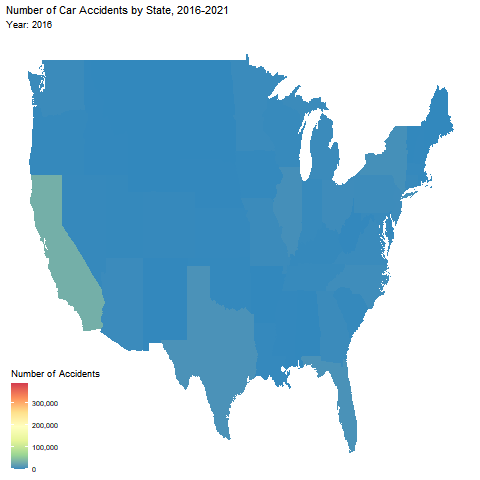
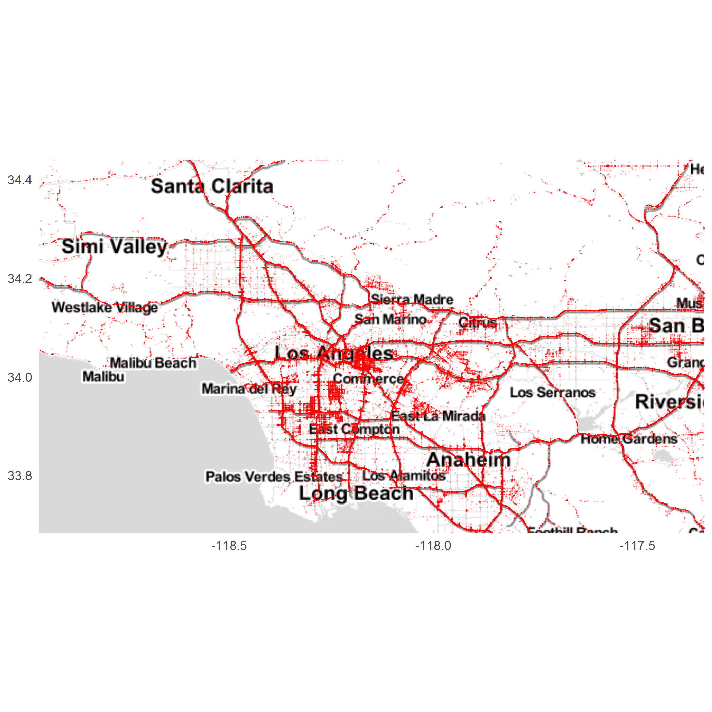

# Introduction
  In our search for an interesting dataset to analyze we came across a wonderfully organized table detailing traffic accidents in the contiguous United States over the last 5 years. What caught our interest in specific was looking at the evolution over time of crash statistics in specific states- most notably California. As the graph below shows, the number of accidents in California has been doubling each year, and we wanted to figure out just what was happening. The dataset we're working with is extraordinarily large, containing over 2.8 million accidents taken from automated traffic sensors and logged reports. Each accident has 47 columns of information.




# Data Collection
  Our Data Collection process was pretty simple- we found the data set on [https://www.kaggle.com/datasets/sobhanmoosavi/us-accidents]() and downloaded the csv file. We did run into some issues using this csv, however due to its sheer size (1.1 GB). The fun thing about this data set is that it contains so many details about each crash, which allows us to look for correlations without them being spoon-fed to us. Additionally, the types of data provided allowed us to explore quite a few different types of visualizations: the time was given for each crash, as well as location plus details on the cause of the crash.

# Analysis


<!-- -->


So, what would cause this pattern? The dataset we found had columns for factors such as whether the accident was in the day or the night, what the temperature and weather were like, and the type of accident. Time of day is a big factor in how often accidents occur, even though that effect is mitigated by the fact that fewer people are driving later in the day. We decided to look at the proportion of day to night accidents, still not expecting too much of a correlation.


Oddly enough, we do see an increase in the proportion of night accidents over the last 3 years, though with a dip back down in 2021. Still no sign of what might be contributing to the exponential growth, so we decided to look a bit further into detail, but as the graph below shows the relative proportions of accidents haven't appreciably changed over time.


Next we decided to look at possible effects of changing weather on accidents, but again came up empty.


We also can choose to look at the types of accidents that are occuring. 

<!-- -->


```
## Error in eval(expr, envir, enclos): object 'knitr' not found
```

We see that the spread of causes for accidents grows quite substantially as time goes on, since Traffic Signal accidents start to rival Junction accidents. Looking at the total proportion of all reported accidents that fall under at least one of these categories (for all of the causes available) we get less than 1; if anything the total should be greater than 1 since there are some accidents that fall under two categories. Basically, what we can conclude from this is that the accident reporting that this dataset is built on is incomplete, and there are a lot of unclassified accidents in this dataset. Unfortunately, this isn't the answer we were looking for, but it still gives us some information about the changes occurring in types of accidents over time. 



